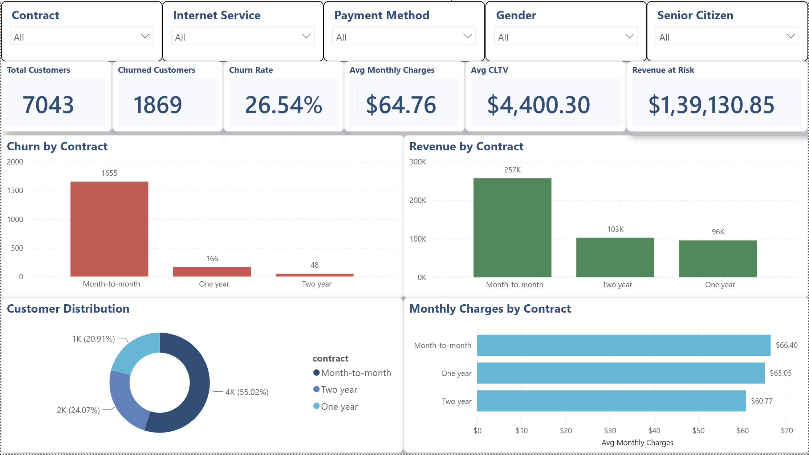
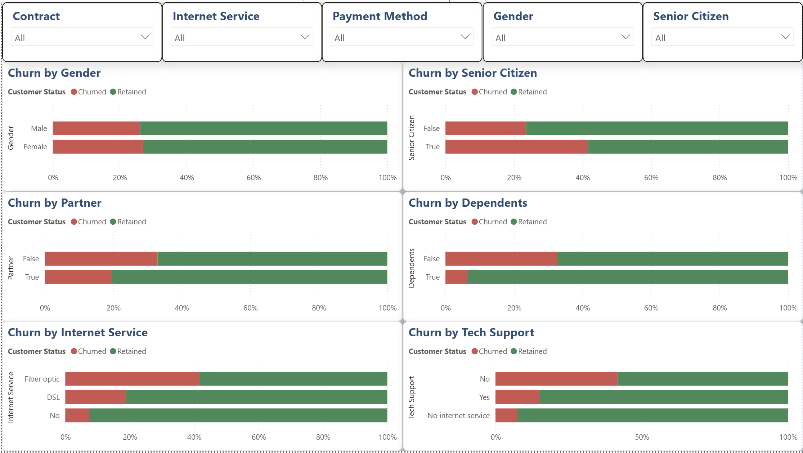
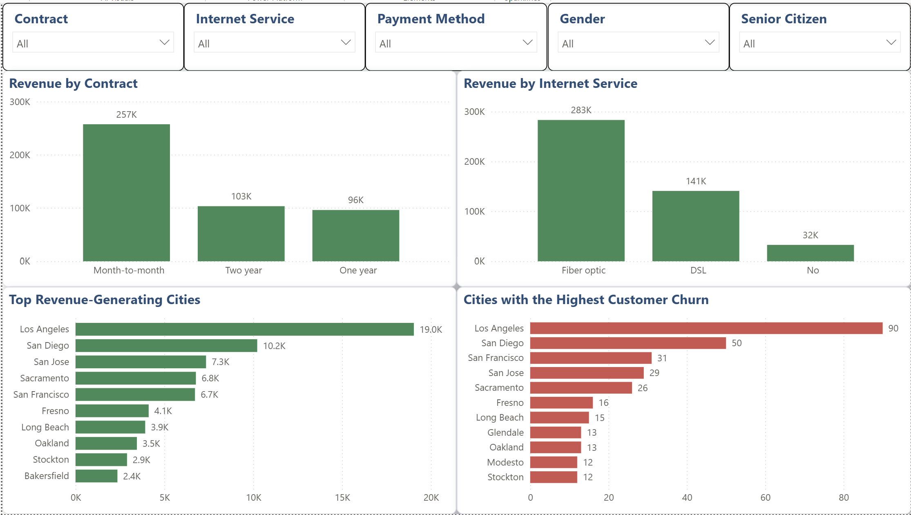
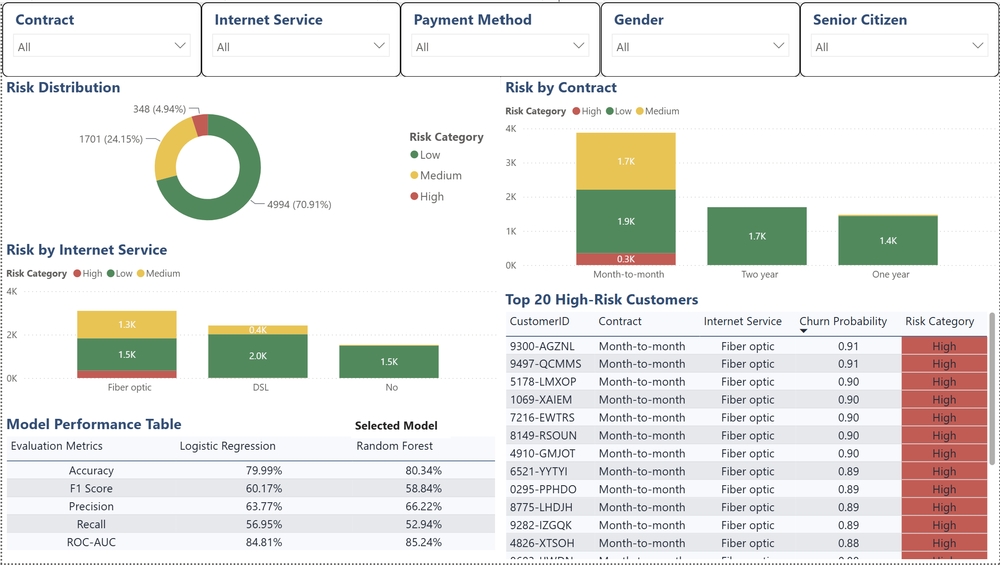

# 📉 Customer Churn & Retention Analytics

An end-to-end Customer Churn Analytics solution that combines **Python, PostgreSQL, SQL, Machine Learning, and Power BI** to identify customer churn patterns, predict high-risk customers, quantify revenue at risk, and provide actionable business recommendations for improving customer retention.

---

## 🌟 Project Highlights

- 📊 Designed a **4-page interactive Power BI dashboard** for executive decision-making.
- 🐍 Built a complete **Python data preprocessing and feature engineering pipeline**.
- 🗄️ Designed a **PostgreSQL database** and developed analytical SQL views.
- 🤖 Trained and evaluated **Logistic Regression** and **Random Forest** machine learning models.
- 🎯 Achieved **85.24% ROC-AUC** using the selected Random Forest model.
- ⚠️ Generated customer-level churn probabilities and categorized customers into **Low, Medium, and High Risk** segments.
- 💼 Delivered business-focused insights and retention recommendations based on analytical findings.

---

# 📌 Project Overview

Customer retention is one of the most critical business challenges for subscription-based companies. Acquiring a new customer typically costs significantly more than retaining an existing one, making churn prediction an essential component of customer relationship management.

This project develops a complete analytics pipeline—from raw customer data to executive dashboards—that enables organizations to:

- Understand historical churn behavior.
- Identify key churn drivers.
- Measure the financial impact of churn.
- Predict customers likely to leave.
- Support proactive customer retention strategies.

The solution combines **Python, PostgreSQL, Machine Learning, and Power BI** into an end-to-end business intelligence workflow.

---

# 🎯 Business Objectives

- Analyze historical customer churn trends.
- Discover demographic and service-related churn drivers.
- Quantify revenue at risk due to customer attrition.
- Predict future churn using machine learning.
- Provide actionable recommendations for improving retention.

---

# 🛠 Tech Stack

| Category | Technologies |
|-----------|--------------|
| Programming | Python |
| Database | PostgreSQL |
| SQL | PostgreSQL Views & Queries |
| Data Processing | Pandas, NumPy |
| Machine Learning | Scikit-learn |
| Model Persistence | Joblib |
| Visualization | Power BI |
| Version Control | Git & GitHub |

---

# 📂 Project Structure

```text
Customer-Churn-Retention-Analytics
│
├── dashboard/
│   └── Customer_Churn_Analytics.pbix
│
├── data/
│   ├── raw/
│   ├── intermediate/
│   └── processed/
│
├── database_exports/
│
├── models/
│   ├── evaluation/
│   ├── preprocessing/
│   └── trained_models/
│
├── notebooks/
│
├── scripts/
│
├── sql/
│   ├── queries/
│   ├── schema/
│   └── views/
│
├── visuals/
│
└── README.md
```

---

# ⚙️ End-to-End Analytics Pipeline

```text
Raw Excel Dataset
        │
        ▼
Data Cleaning (Python)
        │
        ▼
Feature Engineering
        │
        ▼
PostgreSQL Database
        │
        ▼
SQL Views & Business Analysis
        │
        ▼
Machine Learning Models
        │
        ▼
Customer Risk Prediction
        │
        ▼
Power BI Dashboard
        │
        ▼
Business Recommendations
```

---

# 🤖 Machine Learning Pipeline

## Data Preprocessing

The preprocessing pipeline performs:

- Missing value imputation
- One-hot encoding of categorical variables
- Feature scaling using StandardScaler
- Stratified train-test split
- Saving preprocessing artifacts using Joblib

---

## Models Developed

### Logistic Regression

Used as the baseline classification model.

| Metric | Score |
|---------|------:|
| Accuracy | 79.99% |
| Precision | 63.77% |
| Recall | 56.95% |
| F1 Score | 60.17% |
| ROC-AUC | 84.81% |

---

### Random Forest

Hyperparameters optimized using GridSearchCV.

| Metric | Score |
|---------|------:|
| Accuracy | **80.34%** |
| Precision | **66.22%** |
| Recall | 52.94% |
| F1 Score | 58.84% |
| ROC-AUC | **85.24%** |

✅ **Selected Production Model:** Random Forest

---

# 📊 Dashboard

---

# 1️⃣ Executive Overview

<p align="center">

</p>

### Dashboard Highlights

- Executive KPI summary
- Contract-wise churn analysis
- Revenue distribution
- Customer segmentation
- Revenue at Risk estimation

### Key Insights

- Month-to-month contracts account for over **55% of customers** but contribute the overwhelming majority of churn.
- Revenue at Risk exceeds **$139K**, indicating significant financial exposure.
- Customers have an average CLTV of approximately **$4.4K**, highlighting the importance of retention initiatives.
- Contract type is the strongest business indicator of customer churn.

---

# 2️⃣ Customer & Service Analysis

<p align="center">

</p>

### Dashboard Highlights

- Churn by Gender
- Churn by Senior Citizen
- Churn by Partner
- Churn by Dependents
- Churn by Internet Service
- Churn by Tech Support

### Key Insights

- Fiber Optic customers exhibit the highest churn rate.
- Customers without Tech Support churn significantly more often.
- Customers with Dependents demonstrate substantially higher retention.
- Gender has minimal influence on churn behavior.
- Senior Citizens are considerably more likely to churn than non-senior customers.

---

# 3️⃣ Revenue & Geographic Analysis

<p align="center">

</p>

### Dashboard Highlights

- Revenue by Contract
- Revenue by Internet Service
- Top Revenue-Generating Cities
- Cities with Highest Customer Churn

### Key Insights

- Month-to-month customers generate the highest monthly revenue.
- Fiber Optic services contribute the largest revenue share.
- Los Angeles generates the highest revenue while also recording the highest number of churned customers.
- Improving retention in high-revenue cities presents the greatest financial opportunity.

---

# 4️⃣ Predictive Analytics

<p align="center">

</p>

### Dashboard Highlights

- Customer Risk Distribution
- Risk by Contract
- Risk by Internet Service
- Top High-Risk Customers
- Machine Learning Model Comparison

### Key Insights

- Random Forest was selected as the production model after outperforming Logistic Regression.
- **348 customers** were classified as High Risk.
- High-risk customers are predominantly Month-to-month subscribers using Fiber Optic internet.
- Customer-level risk scoring enables proactive retention campaigns before churn occurs.

---

# 🗄 SQL Analytics

Analytical SQL views were developed in PostgreSQL to power the Power BI dashboard.

### SQL Views

- Customer Overview
- Contract Retention
- Internet Service Analysis
- Tech Support Analysis
- Online Security Analysis
- Revenue Analysis
- Geographic Analysis
- Gender Analysis
- Partner Analysis
- Dependents Analysis
- Senior Citizen Analysis

---

# 💡 Business Recommendations

### 1. Convert Month-to-Month Customers

Offer loyalty discounts and long-term contract incentives to customers currently on month-to-month subscriptions.

---

### 2. Improve Fiber Optic Customer Experience

Although Fiber Optic customers contribute the highest revenue, they also represent the highest churn segment. Improving service quality and customer support should be prioritized.

---

### 3. Bundle Value-Added Services

Customers subscribing to Tech Support and Online Security exhibit substantially lower churn rates. Bundling these services could improve customer retention.

---

### 4. Prioritize High-Revenue Cities

Retention campaigns should initially target Los Angeles, San Diego, and other major revenue-generating cities where customer losses are highest.

---

### 5. Deploy Predictive Churn Monitoring

Use the Random Forest model to continuously identify high-risk customers and proactively intervene before churn occurs.

---

# 🚀 Future Enhancements

- Implement XGBoost and LightGBM models.
- Add SHAP explainability for model interpretation.
- Develop Customer Lifetime Value forecasting.
- Build a FastAPI-based real-time prediction service.
- Automate model retraining pipelines.
- Integrate Power BI drill-through reports.
- Deploy the solution using Docker and cloud infrastructure.

---

# 👨‍💻 Author

**Vyom Mangtani**

Engineering Student | Data Analytics | Machine Learning | Business Intelligence

📧 **LinkedIn:** www.linkedin.com/in/vyommangtani

💻 **GitHub:** https://github.com/vrm2310

---

## ⭐ If you found this project interesting, consider giving it a star!